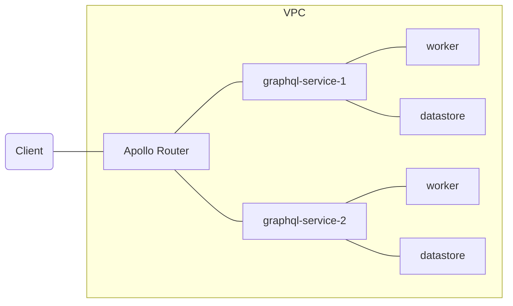

# Introduction

This is a starter project for a modern graphql federation. It is optimized for **1 minute CI/CD**, tests included,
find out how [here](docs/pipelines.md). The main principles are:

- **Fast iteration**: Several sources [[1](https://www.oreilly.com/library/view/accelerate/9781457191435/)]
  [[2](https://circleci.com/resources/2023-state-of-software-delivery/)] [[3](https://cloud.google.com/devops/state-of-devops/)]
  tell us that iteration speed is the main predictor of developer productivity. This project tries to achieve 1 minute
  from push to deployment.
- **Light dependencies**: Each package installed brings benefits, but also costs. This project tries to keep the
  dependencies to a minimum.
- **Testing trophy**: A passing test suite should give the engineer a high credence that the code is production ready.
  This project try to achieve that by inverting the classical testing pyramid, preferring a
  [testing trophy](https://kentcdodds.com/blog/the-testing-trophy-and-testing-classifications) instead.

# Architecture

The federation is composed of several microservices, each one with its own infrastructure. 
The router acts like a [bff](https://blog.bitsrc.io/bff-pattern-backend-for-frontend-an-introduction-e4fa965128bf), 
and performs the collation of all the subgraphs with rover.

# Tools used

- [Apollo router](https://www.apollographql.com/docs/router/): Blazing fast graphql router written in rust
- [Apollo rover](https://www.apollographql.com/docs/rover/): Schema manager and validator written in rust
- [Esbuild](https://esbuild.github.io/): Blazing fast typescript compiler written in golang
- [Rome toolchain](https://rome.tools/): Blazing fast linter and formatter written in golang
- [Ecmascript modules](https://nodejs.org/api/esm.html): Ecmascript modules for easy testing

