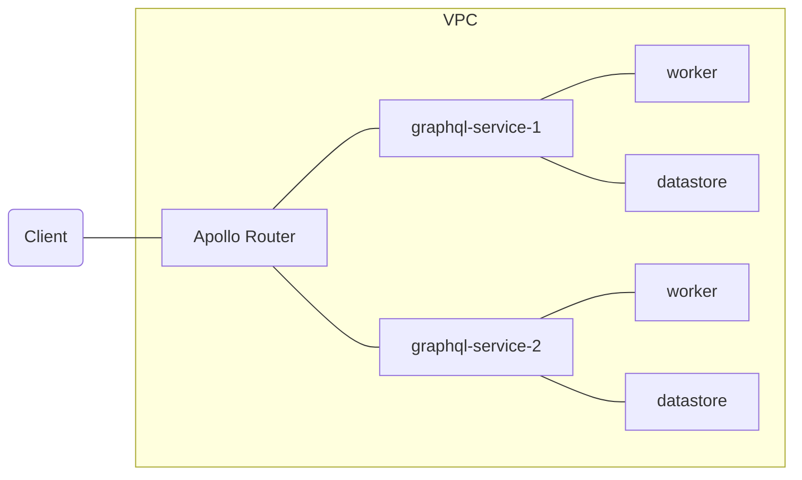

# Introduction

hello

# Design philosophy

# Architecture

# Tools used

- [Apollo router](https://www.apollographql.com/docs/router/): Blazing fast graphql router written in rust
- [Apollo rover](https://www.apollographql.com/docs/rover/): Schema manager and validator written in rust
- [Esbuild](https://esbuild.github.io/): Blazing fast typescript compiler written in golang
- [Rome toolchain](https://rome.tools/): Blazing fast linter and formatter written in golang
- [Ecmascript modules](https://nodejs.org/api/esm.html): Ecmascript modules for easy testing
