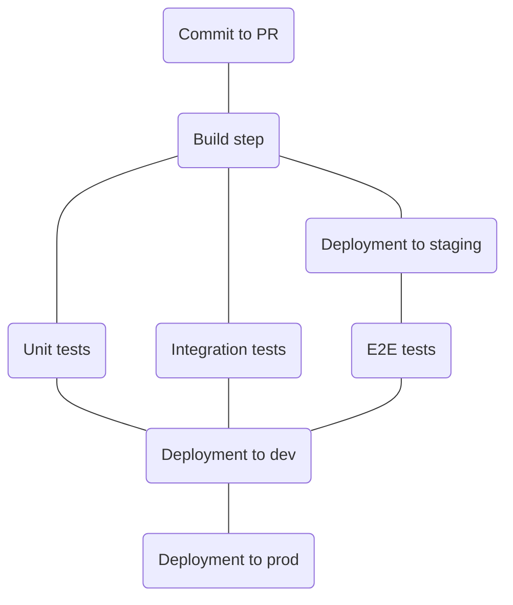

# Blazing fast pipelines

The goal is to have a pipeline that will take around 1 minute from commit to dev deployment. This is achieved
by using the following techniques:

## Build and test only the changes with merkle trees

When [building](https://esbuild.github.io/api/#rebuild) or [testing](https://nodejs.org/api/test.html#watch-mode), 
the ESM resolution tree is decorated with the hash of the file content. This way it's possible to rebuild or 
retest only the changes. 

## Use yarn zero installs

Yarn [zero installs](https://yarnpkg.com/features/zero-installs) is a new feature that allows to cache your 
dependencies in your repo. It has the downside of increasing your repo size, in exchange for blazing
fast build times and protection against [supply chain attacks](https://en.wikipedia.org/wiki/Supply_chain_attack).

## Optimistic pipelines

Usually pipelines are serial, and requires all the previous steps to succeed before moving to the next one. 
This project uses optimistic pipelines instead, in which the steps are executed in parallel, 
and the next step always assumes that the previous one will succeed, falling back to a previous state if it fails.

- Developer push a commit to a PR
- Build artifacts are generated, reusing the cache if possible
- Deployment to staging starts immediately
- In the meanwhile integrations and unit tests are run, reusing the cache if possible
- When deployment to staging finishes, e2e tests are run
- When PR is merged, staging **replaces** dev and prod, with instanteous results

## Don't build npm packages

Many build pipeline make the mistake of building npm packages. There is no need to do that, 
as it greatly increase the building times and bundle size. Instead this project marks
npm packages as external, and let node resolve them at runtime.

## Use Rust / Golang / C++ in your pipeline

The esbuild bundler is 3 orders of magnitude faster thank webpack [[source](https://esbuild.github.io/)], 
and the Rome toolchain is 25x faster than eslint [[source](https://github.com/rome/tools/blob/main/benchmark/README.md)].
The C++ node test runner presents similar speedups.

## Cache your artifacts 

There are several tutorials on best practices for caching your builds, I won't repeat them here.

## Cache your memory with CRIU

A further step that can be taken for caching, is to save the memory of your build containers with CRIU.
This is similar to what [Azul crac](https://www.azul.com/blog/superfast-application-startup-java-on-crac/) 
does for Java, or V8 snapshots for [Node](https://github.com/nodejs/node/issues/17058).
